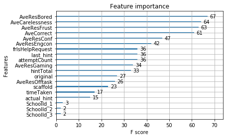

## <font color=black>ASSISTments-Data-Mining-Competition-2017 </font>
<br>
#### <font color=black>The notebook consists of 4 steps: </font>

-  #### <font color=blue>Step 1 : Preprocessing - Exploratory Data Analysis(EDA) - Preprocessing </font>
-  #### <font color=blue>Step 2 : EDA - Feature Engineering - EDA - Preproccesing </font>
-  #### <font color=blue>Step 3 : Preproccesing for Classification  </font>
-  #### <font color=blue>Step 4 : Classification </font>


```python
import pandas as pd
import os
import glob
import matplotlib.pyplot as plt
import numpy as np

#importing for Regression problem

import xgboost as xgb
from sklearn.model_selection import train_test_split
from sklearn.model_selection import GridSearchCV, RandomizedSearchCV
from sklearn.model_selection import TimeSeriesSplit
from sklearn.metrics import mean_squared_error 
from sklearn.metrics import r2_score
from sklearn.svm import SVR
from sklearn.ensemble import RandomForestRegressor 

#importing for Classification problem

from sklearn.metrics import accuracy_score 
from sklearn.tree import DecisionTreeClassifier
from sklearn.neighbors import KNeighborsClassifier as KNN
from sklearn.linear_model import LogisticRegression
from sklearn.tree import DecisionTreeClassifier  
from sklearn.svm  import SVC , LinearSVC

from IPython.display import display, HTML
```

## <font color=black>Step 1 : Preprocessing - Exploratory Data Analysis(EDA) - Preprocessing</font>


```python
#path to the directory where log files and training set are stored 

path_log = r'E:/Data Science assignment/Datafiles/'

```


```python
# looping over the log files 

files = glob.glob(str(path_log + 'student_log_*'))

dflist = [pd.read_csv(file) for file in files]

# Concatenate the log files as single dataframe : df_log

df_log = pd.concat(dflist, axis=0 , sort =False)

print(df_log.head())
```

    C:\Users\Sidhant\Anaconda3\lib\site-packages\IPython\core\interactiveshell.py:2903: DtypeWarning: Columns (74,75) have mixed types. Specify dtype option on import or set low_memory=False.
      if self.run_code(code, result):
    

       ITEST_id SY ASSISTments Usage   AveKnow  AveCarelessness  AveCorrect  \
    0         8            2004-2005  0.352416         0.183276    0.483902   
    1         8            2004-2005  0.352416         0.183276    0.483902   
    2         8            2004-2005  0.352416         0.183276    0.483902   
    3         8            2004-2005  0.352416         0.183276    0.483902   
    4         8            2004-2005  0.352416         0.183276    0.483902   
    
       NumActions  AveResBored  AveResEngcon  AveResConf  AveResFrust    ...      \
    0        1056     0.208389      0.679126    0.115905     0.112408    ...       
    1        1056     0.208389      0.679126    0.115905     0.112408    ...       
    2        1056     0.208389      0.679126    0.115905     0.112408    ...       
    3        1056     0.208389      0.679126    0.115905     0.112408    ...       
    4        1056     0.208389      0.679126    0.115905     0.112408    ...       
    
       confidence(OFF TASK)  confidence(GAMING)  RES_BORED RES_CONCENTRATING  \
    0              0.838710            0.008522   0.376427          0.320317   
    1              0.600000            0.047821   0.156027          0.995053   
    2              0.600000            0.047821   0.156027          0.995053   
    3              0.204082            0.343996   0.156027          0.744520   
    4              0.204082            0.343996   0.156027          0.744520   
    
       RES_CONFUSED  RES_FRUSTRATED  RES_OFFTASK  RES_GAMING       Ln-1         Ln  
    0      0.000000             0.0     0.785585    0.000264       0.13  0.0611904  
    1      0.887452             0.0     0.468252    0.001483  0.0611904    0.21351  
    2      0.887452             0.0     0.468252    0.001483      0.116  0.0333058  
    3      0.000000             0.0     0.108417    0.010665      0.116  0.0333058  
    4      0.000000             0.0     0.108417    0.010665  0.0333058   0.118386  
    
    [5 rows x 76 columns]
    


```python
# Fetching the training data in dataframe : df_train_set

df_train_set = pd.read_csv(str(path_log+'training_label.csv'))

# prepare a list of students available in training data

dfList = df_train_set['ITEST_id'].tolist()

print(df_train_set.head())
```

       ITEST_id  SchoolId  AveCorrect  MCAS  isSTEM
    0         9         2    0.438492  32.0       1
    1        27         1    0.348837  21.0       0
    2        33         2    0.686391  52.0       0
    3        35         2    0.379658  34.0       0
    4        37         3    0.305785   NaN       0
    


```python
# filter the df_log with only the relevant ITEST_id comparing with training set ITEST_id

df_filter = df_log[df_log.ITEST_id.isin(dfList)]

df_filter.head()

```


<div>
<style scoped>
    .dataframe tbody tr th:only-of-type {
        vertical-align: middle;
    }

    .dataframe tbody tr th {
        vertical-align: top;
    }

    .dataframe thead th {
        text-align: right;
    }
</style>
<table border="1" class="dataframe">
  <thead>
    <tr style="text-align: right;">
      <th></th>
      <th>ITEST_id</th>
      <th>SY ASSISTments Usage</th>
      <th>AveKnow</th>
      <th>AveCarelessness</th>
      <th>AveCorrect</th>
      <th>NumActions</th>
      <th>AveResBored</th>
      <th>AveResEngcon</th>
      <th>AveResConf</th>
      <th>AveResFrust</th>
      <th>...</th>
      <th>confidence(OFF TASK)</th>
      <th>confidence(GAMING)</th>
      <th>RES_BORED</th>
      <th>RES_CONCENTRATING</th>
      <th>RES_CONFUSED</th>
      <th>RES_FRUSTRATED</th>
      <th>RES_OFFTASK</th>
      <th>RES_GAMING</th>
      <th>Ln-1</th>
      <th>Ln</th>
    </tr>
  </thead>
  <tbody>
    <tr>
      <th>1056</th>
      <td>35</td>
      <td>2004-2005</td>
      <td>0.255164</td>
      <td>0.158848</td>
      <td>0.379658</td>
      <td>993</td>
      <td>0.222796</td>
      <td>0.650079</td>
      <td>0.069987</td>
      <td>0.164347</td>
      <td>...</td>
      <td>0.916667</td>
      <td>0.186970</td>
      <td>0.505313</td>
      <td>0.262675</td>
      <td>0.060808</td>
      <td>0.000000</td>
      <td>0.889219</td>
      <td>0.005797</td>
      <td>0.271</td>
      <td>0.0778992</td>
    </tr>
    <tr>
      <th>1057</th>
      <td>35</td>
      <td>2004-2005</td>
      <td>0.255164</td>
      <td>0.158848</td>
      <td>0.379658</td>
      <td>993</td>
      <td>0.222796</td>
      <td>0.650079</td>
      <td>0.069987</td>
      <td>0.164347</td>
      <td>...</td>
      <td>0.204082</td>
      <td>0.047821</td>
      <td>0.156027</td>
      <td>0.696486</td>
      <td>0.000000</td>
      <td>0.009561</td>
      <td>0.108417</td>
      <td>0.001483</td>
      <td>0.0778992</td>
      <td>0.225856</td>
    </tr>
    <tr>
      <th>1058</th>
      <td>35</td>
      <td>2004-2005</td>
      <td>0.255164</td>
      <td>0.158848</td>
      <td>0.379658</td>
      <td>993</td>
      <td>0.222796</td>
      <td>0.650079</td>
      <td>0.069987</td>
      <td>0.164347</td>
      <td>...</td>
      <td>0.204082</td>
      <td>0.127084</td>
      <td>0.156027</td>
      <td>0.580763</td>
      <td>0.000000</td>
      <td>0.009561</td>
      <td>0.108417</td>
      <td>0.003940</td>
      <td>0.225856</td>
      <td>0.483008</td>
    </tr>
    <tr>
      <th>1059</th>
      <td>35</td>
      <td>2004-2005</td>
      <td>0.255164</td>
      <td>0.158848</td>
      <td>0.379658</td>
      <td>993</td>
      <td>0.222796</td>
      <td>0.650079</td>
      <td>0.069987</td>
      <td>0.164347</td>
      <td>...</td>
      <td>0.204082</td>
      <td>0.127084</td>
      <td>0.156027</td>
      <td>0.580763</td>
      <td>0.000000</td>
      <td>0.009561</td>
      <td>0.108417</td>
      <td>0.003940</td>
      <td>0.483008</td>
      <td>0.74529</td>
    </tr>
    <tr>
      <th>1060</th>
      <td>35</td>
      <td>2004-2005</td>
      <td>0.255164</td>
      <td>0.158848</td>
      <td>0.379658</td>
      <td>993</td>
      <td>0.222796</td>
      <td>0.650079</td>
      <td>0.069987</td>
      <td>0.164347</td>
      <td>...</td>
      <td>0.600000</td>
      <td>0.047821</td>
      <td>0.156027</td>
      <td>0.898073</td>
      <td>0.000000</td>
      <td>0.009561</td>
      <td>0.468252</td>
      <td>0.001483</td>
      <td>0.74529</td>
      <td>0.900994</td>
    </tr>
  </tbody>
</table>
<p>5 rows × 76 columns</p>
</div>


## <font color=black>Step 2 : EDA - Feature Engineering - EDA - Preproccesing </font>


```python
# Checking for NaN values in the df_filter

df_filter.isna().sum()
```


    ITEST_id                                  0
    SY ASSISTments Usage                      0
    AveKnow                                   0
    AveCarelessness                           0
    AveCorrect                                0
    NumActions                                0
    AveResBored                               0
    AveResEngcon                              0
    AveResConf                                0
    AveResFrust                               0
    AveResOfftask                             0
    AveResGaming                              0
    actionId                                  0
    skill                                     0
    problemId                                 0
    assignmentId                              0
    assistmentId                              0
    startTime                                 0
    endTime                                   0
    timeTaken                                 0
    correct                                   0
    original                                  0
    hint                                      0
    hintCount                                 0
    hintTotal                                 0
    scaffold                                  0
    bottomHint                                0
    attemptCount                              0
    problemType                               0
    frIsHelpRequest                           0
                                             ..
    endsWithAutoScaffolding                   0
    frTimeTakenOnScaffolding                  0
    frTotalSkillOpportunitiesScaffolding      0
    totalFrSkillOpportunitiesByScaffolding    0
    frIsHelpRequestScaffolding                0
    timeGreater5Secprev2wrong                 0
    sumRight                                  0
    helpAccessUnder2Sec                       0
    timeGreater10SecAndNextActionRight        0
    consecutiveErrorsInRow                    0
    sumTime3SDWhen3RowRight                   0
    sumTimePerSkill                           0
    totalTimeByPercentCorrectForskill         0
    prev5count                                0
    timeOver80                                0
    manywrong                                 0
    confidence(BORED)                         0
    confidence(CONCENTRATING)                 0
    confidence(CONFUSED)                      0
    confidence(FRUSTRATED)                    0
    confidence(OFF TASK)                      0
    confidence(GAMING)                        0
    RES_BORED                                 0
    RES_CONCENTRATING                         0
    RES_CONFUSED                              0
    RES_FRUSTRATED                            0
    RES_OFFTASK                               0
    RES_GAMING                                0
    Ln-1                                      0
    Ln                                        0
    Length: 76, dtype: int64


```python
# Replacing NaN values with zero(0) for df_filter column 'sumTime3SDWhen3RowRight'

df_filter['sumTime3SDWhen3RowRight'].fillna(0, inplace= True)

#recheking effects to take place

df_filter['sumTime3SDWhen3RowRight'].isna().sum()
```

    C:\Users\Sidhant\Anaconda3\lib\site-packages\pandas\core\generic.py:5430: SettingWithCopyWarning: 
    A value is trying to be set on a copy of a slice from a DataFrame
    
    See the caveats in the documentation: http://pandas.pydata.org/pandas-docs/stable/indexing.html#indexing-view-versus-copy
      self._update_inplace(new_data)
    


    0


#### <font color=blue>Feature Engineering Explaination</font>
<br>
<br>
The feature set of feature to get dropped are the IDs : 'actionId', 'problemId', 'assignmentId', 'assistmentId'<br> 
<br>
The second set of features are the ones mentioned in the rows 63 to 76 row of 'ASSISTments Data Mining Competition 2017- data description' : <br>
<br>
'confidence(BORED)', 'confidence(CONCENTRATING)','confidence(CONFUSED)', 'confidence(FRUSTRATED)','confidence(OFF TASK)', 'confidence(GAMING)', 'RES_BORED','RES_CONCENTRATING', 'RES_CONFUSED', 'RES_FRUSTRATED', 'RES_OFFTASK','RES_GAMING', 'Ln-1', 'Ln'<br>
<br>
'SY ASSISTments Usage' has been dropped as year the test was given is not an important determiner <br>
<br>
'responseIsChosen' had no variation <br>
<br>
'startTime', 'endTime' are correlated with time taken


```python
# list of features from dataframe df_filter to be removed based on analysis of data through.... 
# analysis of ASSISTments Data Mining Competition 2017- data description  : drop_list


drop_list = [ 'actionId', 'problemId', 'assignmentId', 'assistmentId','confidence(BORED)', 'confidence(CONCENTRATING)',
       'confidence(CONFUSED)', 'confidence(FRUSTRATED)',
       'confidence(OFF TASK)', 'confidence(GAMING)', 'RES_BORED',
       'RES_CONCENTRATING', 'RES_CONFUSED', 'RES_FRUSTRATED', 'RES_OFFTASK',
       'RES_GAMING', 'Ln-1', 'Ln', 'responseIsChosen','SY ASSISTments Usage', 'startTime', 'endTime']

# dropping the columns and creating a new dataframe : df_drop_cols
df_drop_cols = df_filter.drop(drop_list , axis=1)
df_drop_cols.head()
```


<div>
<style scoped>
    .dataframe tbody tr th:only-of-type {
        vertical-align: middle;
    }

    .dataframe tbody tr th {
        vertical-align: top;
    }

    .dataframe thead th {
        text-align: right;
    }
</style>
<table border="1" class="dataframe">
  <thead>
    <tr style="text-align: right;">
      <th></th>
      <th>ITEST_id</th>
      <th>AveKnow</th>
      <th>AveCarelessness</th>
      <th>AveCorrect</th>
      <th>NumActions</th>
      <th>AveResBored</th>
      <th>AveResEngcon</th>
      <th>AveResConf</th>
      <th>AveResFrust</th>
      <th>AveResOfftask</th>
      <th>...</th>
      <th>sumRight</th>
      <th>helpAccessUnder2Sec</th>
      <th>timeGreater10SecAndNextActionRight</th>
      <th>consecutiveErrorsInRow</th>
      <th>sumTime3SDWhen3RowRight</th>
      <th>sumTimePerSkill</th>
      <th>totalTimeByPercentCorrectForskill</th>
      <th>prev5count</th>
      <th>timeOver80</th>
      <th>manywrong</th>
    </tr>
  </thead>
  <tbody>
    <tr>
      <th>1056</th>
      <td>35</td>
      <td>0.255164</td>
      <td>0.158848</td>
      <td>0.379658</td>
      <td>993</td>
      <td>0.222796</td>
      <td>0.650079</td>
      <td>0.069987</td>
      <td>0.164347</td>
      <td>0.153147</td>
      <td>...</td>
      <td>0</td>
      <td>0</td>
      <td>0</td>
      <td>0</td>
      <td>0.000000</td>
      <td>130.0</td>
      <td>0.000000</td>
      <td>0</td>
      <td>1</td>
      <td>0</td>
    </tr>
    <tr>
      <th>1057</th>
      <td>35</td>
      <td>0.255164</td>
      <td>0.158848</td>
      <td>0.379658</td>
      <td>993</td>
      <td>0.222796</td>
      <td>0.650079</td>
      <td>0.069987</td>
      <td>0.164347</td>
      <td>0.153147</td>
      <td>...</td>
      <td>1</td>
      <td>0</td>
      <td>1</td>
      <td>0</td>
      <td>0.000000</td>
      <td>154.0</td>
      <td>308.000000</td>
      <td>1</td>
      <td>0</td>
      <td>0</td>
    </tr>
    <tr>
      <th>1058</th>
      <td>35</td>
      <td>0.255164</td>
      <td>0.158848</td>
      <td>0.379658</td>
      <td>993</td>
      <td>0.222796</td>
      <td>0.650079</td>
      <td>0.069987</td>
      <td>0.164347</td>
      <td>0.153147</td>
      <td>...</td>
      <td>2</td>
      <td>0</td>
      <td>1</td>
      <td>0</td>
      <td>0.000000</td>
      <td>161.0</td>
      <td>241.500000</td>
      <td>2</td>
      <td>0</td>
      <td>0</td>
    </tr>
    <tr>
      <th>1059</th>
      <td>35</td>
      <td>0.255164</td>
      <td>0.158848</td>
      <td>0.379658</td>
      <td>993</td>
      <td>0.222796</td>
      <td>0.650079</td>
      <td>0.069987</td>
      <td>0.164347</td>
      <td>0.153147</td>
      <td>...</td>
      <td>3</td>
      <td>0</td>
      <td>0</td>
      <td>0</td>
      <td>1.243722</td>
      <td>170.0</td>
      <td>226.666667</td>
      <td>3</td>
      <td>0</td>
      <td>0</td>
    </tr>
    <tr>
      <th>1060</th>
      <td>35</td>
      <td>0.255164</td>
      <td>0.158848</td>
      <td>0.379658</td>
      <td>993</td>
      <td>0.222796</td>
      <td>0.650079</td>
      <td>0.069987</td>
      <td>0.164347</td>
      <td>0.153147</td>
      <td>...</td>
      <td>4</td>
      <td>0</td>
      <td>0</td>
      <td>0</td>
      <td>0.973446</td>
      <td>189.0</td>
      <td>236.250000</td>
      <td>4</td>
      <td>0</td>
      <td>0</td>
    </tr>
  </tbody>
</table>
<p>5 rows × 54 columns</p>
</div>


#### <font color=blue>Feature Engineering Explaination continued...</font>

<br>
The features dropped below are based on the dicretion inferred from the explanations given for the datasets in 
'ASSISTments Data Mining Competition 2017- data description'<br>
<br>
Further the features 'hint' and 'helpAccessUnder2Sec' have been combined to 'actual_hint' feature.<br>
Logic : if hint was taken and it was for less than 2 seconds then , it should not be counted as hint<br>
<br>
With a similar approach the features 'bottomHint' and 'stlHintUsed' have been combined to 'last_hint' feature.<br>
Logic : if hint was taken at last or second to last , it is equivalent to taking hint at last step<br>
<br>
'MCAS' and 'SchoolID' are another set of feature which will be added in the log dataframe from the training set data


```python
#list of second set of columns to be dropped  : drop_list

drop_list = ['NumActions',  'skill', 'hintCount', 'problemType', 'frPast5HelpRequest', 'frPast8HelpRequest', 'past8BottomOut', 'totalFrPercentPastWrong', 'totalFrPastWrongCount', 'frPast5WrongCount', 'frPast8WrongCount',  'totalFrTimeOnSkill','timeSinceSkill','frWorkingInSchool','totalFrAttempted','totalFrSkillOpportunities','responseIsFillIn','endsWithScaffolding','endsWithAutoScaffolding','frTimeTakenOnScaffolding','frTotalSkillOpportunitiesScaffolding','totalFrSkillOpportunitiesByScaffolding','frIsHelpRequestScaffolding','timeGreater5Secprev2wrong','sumRight','timeGreater10SecAndNextActionRight','consecutiveErrorsInRow','sumTime3SDWhen3RowRight','sumTimePerSkill','totalTimeByPercentCorrectForskill','prev5count','timeOver80','manywrong']

#dropping the second set of columns from df_drop_cols

df_drop_cols = df_drop_cols.drop(drop_list , axis=1)
df_drop_cols.head()

```


<div>
<style scoped>
    .dataframe tbody tr th:only-of-type {
        vertical-align: middle;
    }

    .dataframe tbody tr th {
        vertical-align: top;
    }

    .dataframe thead th {
        text-align: right;
    }
</style>
<table border="1" class="dataframe">
  <thead>
    <tr style="text-align: right;">
      <th></th>
      <th>ITEST_id</th>
      <th>AveKnow</th>
      <th>AveCarelessness</th>
      <th>AveCorrect</th>
      <th>AveResBored</th>
      <th>AveResEngcon</th>
      <th>AveResConf</th>
      <th>AveResFrust</th>
      <th>AveResOfftask</th>
      <th>AveResGaming</th>
      <th>...</th>
      <th>correct</th>
      <th>original</th>
      <th>hint</th>
      <th>hintTotal</th>
      <th>scaffold</th>
      <th>bottomHint</th>
      <th>attemptCount</th>
      <th>frIsHelpRequest</th>
      <th>stlHintUsed</th>
      <th>helpAccessUnder2Sec</th>
    </tr>
  </thead>
  <tbody>
    <tr>
      <th>1056</th>
      <td>35</td>
      <td>0.255164</td>
      <td>0.158848</td>
      <td>0.379658</td>
      <td>0.222796</td>
      <td>0.650079</td>
      <td>0.069987</td>
      <td>0.164347</td>
      <td>0.153147</td>
      <td>0.2368</td>
      <td>...</td>
      <td>0</td>
      <td>1</td>
      <td>0</td>
      <td>0</td>
      <td>0</td>
      <td>0</td>
      <td>1</td>
      <td>0</td>
      <td>0</td>
      <td>0</td>
    </tr>
    <tr>
      <th>1057</th>
      <td>35</td>
      <td>0.255164</td>
      <td>0.158848</td>
      <td>0.379658</td>
      <td>0.222796</td>
      <td>0.650079</td>
      <td>0.069987</td>
      <td>0.164347</td>
      <td>0.153147</td>
      <td>0.2368</td>
      <td>...</td>
      <td>1</td>
      <td>0</td>
      <td>0</td>
      <td>0</td>
      <td>1</td>
      <td>0</td>
      <td>1</td>
      <td>1</td>
      <td>0</td>
      <td>0</td>
    </tr>
    <tr>
      <th>1058</th>
      <td>35</td>
      <td>0.255164</td>
      <td>0.158848</td>
      <td>0.379658</td>
      <td>0.222796</td>
      <td>0.650079</td>
      <td>0.069987</td>
      <td>0.164347</td>
      <td>0.153147</td>
      <td>0.2368</td>
      <td>...</td>
      <td>1</td>
      <td>0</td>
      <td>0</td>
      <td>0</td>
      <td>1</td>
      <td>0</td>
      <td>1</td>
      <td>1</td>
      <td>0</td>
      <td>0</td>
    </tr>
    <tr>
      <th>1059</th>
      <td>35</td>
      <td>0.255164</td>
      <td>0.158848</td>
      <td>0.379658</td>
      <td>0.222796</td>
      <td>0.650079</td>
      <td>0.069987</td>
      <td>0.164347</td>
      <td>0.153147</td>
      <td>0.2368</td>
      <td>...</td>
      <td>1</td>
      <td>0</td>
      <td>0</td>
      <td>0</td>
      <td>1</td>
      <td>0</td>
      <td>1</td>
      <td>1</td>
      <td>0</td>
      <td>0</td>
    </tr>
    <tr>
      <th>1060</th>
      <td>35</td>
      <td>0.255164</td>
      <td>0.158848</td>
      <td>0.379658</td>
      <td>0.222796</td>
      <td>0.650079</td>
      <td>0.069987</td>
      <td>0.164347</td>
      <td>0.153147</td>
      <td>0.2368</td>
      <td>...</td>
      <td>1</td>
      <td>0</td>
      <td>0</td>
      <td>0</td>
      <td>1</td>
      <td>0</td>
      <td>1</td>
      <td>1</td>
      <td>0</td>
      <td>0</td>
    </tr>
  </tbody>
</table>
<p>5 rows × 21 columns</p>
</div>


```python
# combining the features 'hint' and 'helpAccessUnder2Sec' in 'actual_hint' feature in a list : actual_hint

actual_hint = [ 1 if row['hint'] == 1 and row['helpAccessUnder2Sec'] == 1 else row['hint'] for index, row in df_drop_cols.iterrows()]

# combining the features 'bottomHint' and 'stlHintUsed' in 'last_hint' feature in a list : last_hint

last_hint = [ 1 if row['bottomHint'] == 1 or row['stlHintUsed'] == 1 else 0 for index, row in df_drop_cols.iterrows()]
```


```python
# dropping the features to be combined as : df_drop_cols2
#['hint'] + ['helpAccessUnder2Sec'] = ['actual_hint']
#['bottomHint'] + ['stlHintUsed'] = ['last_hint']

df_drop_cols2 = df_drop_cols.drop(['hint', 'helpAccessUnder2Sec', 'bottomHint', 'stlHintUsed']  , axis=1)
df_drop_cols2['actual_hint'] = actual_hint
df_drop_cols2['last_hint'] = last_hint
df_drop_cols2.head()  
```


<div>
<style scoped>
    .dataframe tbody tr th:only-of-type {
        vertical-align: middle;
    }

    .dataframe tbody tr th {
        vertical-align: top;
    }

    .dataframe thead th {
        text-align: right;
    }
</style>
<table border="1" class="dataframe">
  <thead>
    <tr style="text-align: right;">
      <th></th>
      <th>ITEST_id</th>
      <th>AveKnow</th>
      <th>AveCarelessness</th>
      <th>AveCorrect</th>
      <th>AveResBored</th>
      <th>AveResEngcon</th>
      <th>AveResConf</th>
      <th>AveResFrust</th>
      <th>AveResOfftask</th>
      <th>AveResGaming</th>
      <th>timeTaken</th>
      <th>correct</th>
      <th>original</th>
      <th>hintTotal</th>
      <th>scaffold</th>
      <th>attemptCount</th>
      <th>frIsHelpRequest</th>
      <th>actual_hint</th>
      <th>last_hint</th>
    </tr>
  </thead>
  <tbody>
    <tr>
      <th>1056</th>
      <td>35</td>
      <td>0.255164</td>
      <td>0.158848</td>
      <td>0.379658</td>
      <td>0.222796</td>
      <td>0.650079</td>
      <td>0.069987</td>
      <td>0.164347</td>
      <td>0.153147</td>
      <td>0.2368</td>
      <td>130.0</td>
      <td>0</td>
      <td>1</td>
      <td>0</td>
      <td>0</td>
      <td>1</td>
      <td>0</td>
      <td>0.0</td>
      <td>0</td>
    </tr>
    <tr>
      <th>1057</th>
      <td>35</td>
      <td>0.255164</td>
      <td>0.158848</td>
      <td>0.379658</td>
      <td>0.222796</td>
      <td>0.650079</td>
      <td>0.069987</td>
      <td>0.164347</td>
      <td>0.153147</td>
      <td>0.2368</td>
      <td>24.0</td>
      <td>1</td>
      <td>0</td>
      <td>0</td>
      <td>1</td>
      <td>1</td>
      <td>1</td>
      <td>0.0</td>
      <td>0</td>
    </tr>
    <tr>
      <th>1058</th>
      <td>35</td>
      <td>0.255164</td>
      <td>0.158848</td>
      <td>0.379658</td>
      <td>0.222796</td>
      <td>0.650079</td>
      <td>0.069987</td>
      <td>0.164347</td>
      <td>0.153147</td>
      <td>0.2368</td>
      <td>7.0</td>
      <td>1</td>
      <td>0</td>
      <td>0</td>
      <td>1</td>
      <td>1</td>
      <td>1</td>
      <td>0.0</td>
      <td>0</td>
    </tr>
    <tr>
      <th>1059</th>
      <td>35</td>
      <td>0.255164</td>
      <td>0.158848</td>
      <td>0.379658</td>
      <td>0.222796</td>
      <td>0.650079</td>
      <td>0.069987</td>
      <td>0.164347</td>
      <td>0.153147</td>
      <td>0.2368</td>
      <td>9.0</td>
      <td>1</td>
      <td>0</td>
      <td>0</td>
      <td>1</td>
      <td>1</td>
      <td>1</td>
      <td>0.0</td>
      <td>0</td>
    </tr>
    <tr>
      <th>1060</th>
      <td>35</td>
      <td>0.255164</td>
      <td>0.158848</td>
      <td>0.379658</td>
      <td>0.222796</td>
      <td>0.650079</td>
      <td>0.069987</td>
      <td>0.164347</td>
      <td>0.153147</td>
      <td>0.2368</td>
      <td>19.0</td>
      <td>1</td>
      <td>0</td>
      <td>0</td>
      <td>1</td>
      <td>1</td>
      <td>1</td>
      <td>0.0</td>
      <td>0</td>
    </tr>
  </tbody>
</table>
</div>


```python
# aggregating dataframe based on ['ITEST_id'] feature in the dataframe : df_agg

df_agg = df_drop_cols2.groupby(['ITEST_id']).mean()
df_agg.head()
```


<div>
<style scoped>
    .dataframe tbody tr th:only-of-type {
        vertical-align: middle;
    }

    .dataframe tbody tr th {
        vertical-align: top;
    }

    .dataframe thead th {
        text-align: right;
    }
</style>
<table border="1" class="dataframe">
  <thead>
    <tr style="text-align: right;">
      <th></th>
      <th>AveKnow</th>
      <th>AveCarelessness</th>
      <th>AveCorrect</th>
      <th>AveResBored</th>
      <th>AveResEngcon</th>
      <th>AveResConf</th>
      <th>AveResFrust</th>
      <th>AveResOfftask</th>
      <th>AveResGaming</th>
      <th>timeTaken</th>
      <th>correct</th>
      <th>original</th>
      <th>hintTotal</th>
      <th>scaffold</th>
      <th>attemptCount</th>
      <th>frIsHelpRequest</th>
      <th>actual_hint</th>
      <th>last_hint</th>
    </tr>
    <tr>
      <th>ITEST_id</th>
      <th></th>
      <th></th>
      <th></th>
      <th></th>
      <th></th>
      <th></th>
      <th></th>
      <th></th>
      <th></th>
      <th></th>
      <th></th>
      <th></th>
      <th></th>
      <th></th>
      <th></th>
      <th></th>
      <th></th>
      <th></th>
    </tr>
  </thead>
  <tbody>
    <tr>
      <th>9</th>
      <td>0.185138</td>
      <td>0.099734</td>
      <td>0.438492</td>
      <td>0.277149</td>
      <td>0.644744</td>
      <td>0.098078</td>
      <td>0.162771</td>
      <td>0.213378</td>
      <td>0.005554</td>
      <td>42.494048</td>
      <td>0.438492</td>
      <td>0.244048</td>
      <td>1.041667</td>
      <td>0.545635</td>
      <td>2.065476</td>
      <td>0.357143</td>
      <td>0.212302</td>
      <td>0.027778</td>
    </tr>
    <tr>
      <th>27</th>
      <td>0.142031</td>
      <td>0.069297</td>
      <td>0.348837</td>
      <td>0.330226</td>
      <td>0.551367</td>
      <td>0.122658</td>
      <td>0.095420</td>
      <td>0.348090</td>
      <td>0.036900</td>
      <td>92.457364</td>
      <td>0.348837</td>
      <td>0.201550</td>
      <td>1.713178</td>
      <td>0.372093</td>
      <td>2.457364</td>
      <td>0.279070</td>
      <td>0.294574</td>
      <td>0.077519</td>
    </tr>
    <tr>
      <th>33</th>
      <td>0.459813</td>
      <td>0.202787</td>
      <td>0.686391</td>
      <td>0.260426</td>
      <td>0.650769</td>
      <td>0.059971</td>
      <td>0.061834</td>
      <td>0.296286</td>
      <td>0.010954</td>
      <td>71.526627</td>
      <td>0.686391</td>
      <td>0.396450</td>
      <td>0.248521</td>
      <td>0.526627</td>
      <td>1.491124</td>
      <td>0.396450</td>
      <td>0.041420</td>
      <td>0.005917</td>
    </tr>
    <tr>
      <th>35</th>
      <td>0.255164</td>
      <td>0.158848</td>
      <td>0.379658</td>
      <td>0.222796</td>
      <td>0.650079</td>
      <td>0.069987</td>
      <td>0.164347</td>
      <td>0.153147</td>
      <td>0.236800</td>
      <td>24.695871</td>
      <td>0.379658</td>
      <td>0.319235</td>
      <td>1.968781</td>
      <td>0.318228</td>
      <td>3.465257</td>
      <td>0.254783</td>
      <td>0.338369</td>
      <td>0.062437</td>
    </tr>
    <tr>
      <th>37</th>
      <td>0.071909</td>
      <td>0.046183</td>
      <td>0.305785</td>
      <td>0.326384</td>
      <td>0.653445</td>
      <td>0.125325</td>
      <td>0.094714</td>
      <td>0.451467</td>
      <td>0.016241</td>
      <td>63.537190</td>
      <td>0.305785</td>
      <td>0.115702</td>
      <td>1.586777</td>
      <td>0.578512</td>
      <td>2.462810</td>
      <td>0.371901</td>
      <td>0.371901</td>
      <td>0.057851</td>
    </tr>
  </tbody>
</table>
</div>


```python
# Merging the dataframe from log (df_agg) and training data (df_train_set) on 'ITEST_id' as a common feature : df_final

df_final = pd.merge(df_agg, df_train_set[['ITEST_id','SchoolId','MCAS','isSTEM']],  on = 'ITEST_id')
df_final.head()

```


<div>
<style scoped>
    .dataframe tbody tr th:only-of-type {
        vertical-align: middle;
    }

    .dataframe tbody tr th {
        vertical-align: top;
    }

    .dataframe thead th {
        text-align: right;
    }
</style>
<table border="1" class="dataframe">
  <thead>
    <tr style="text-align: right;">
      <th></th>
      <th>ITEST_id</th>
      <th>AveKnow</th>
      <th>AveCarelessness</th>
      <th>AveCorrect</th>
      <th>AveResBored</th>
      <th>AveResEngcon</th>
      <th>AveResConf</th>
      <th>AveResFrust</th>
      <th>AveResOfftask</th>
      <th>AveResGaming</th>
      <th>...</th>
      <th>original</th>
      <th>hintTotal</th>
      <th>scaffold</th>
      <th>attemptCount</th>
      <th>frIsHelpRequest</th>
      <th>actual_hint</th>
      <th>last_hint</th>
      <th>SchoolId</th>
      <th>MCAS</th>
      <th>isSTEM</th>
    </tr>
  </thead>
  <tbody>
    <tr>
      <th>0</th>
      <td>9</td>
      <td>0.185138</td>
      <td>0.099734</td>
      <td>0.438492</td>
      <td>0.277149</td>
      <td>0.644744</td>
      <td>0.098078</td>
      <td>0.162771</td>
      <td>0.213378</td>
      <td>0.005554</td>
      <td>...</td>
      <td>0.244048</td>
      <td>1.041667</td>
      <td>0.545635</td>
      <td>2.065476</td>
      <td>0.357143</td>
      <td>0.212302</td>
      <td>0.027778</td>
      <td>2</td>
      <td>32.0</td>
      <td>1</td>
    </tr>
    <tr>
      <th>1</th>
      <td>27</td>
      <td>0.142031</td>
      <td>0.069297</td>
      <td>0.348837</td>
      <td>0.330226</td>
      <td>0.551367</td>
      <td>0.122658</td>
      <td>0.095420</td>
      <td>0.348090</td>
      <td>0.036900</td>
      <td>...</td>
      <td>0.201550</td>
      <td>1.713178</td>
      <td>0.372093</td>
      <td>2.457364</td>
      <td>0.279070</td>
      <td>0.294574</td>
      <td>0.077519</td>
      <td>1</td>
      <td>21.0</td>
      <td>0</td>
    </tr>
    <tr>
      <th>2</th>
      <td>33</td>
      <td>0.459813</td>
      <td>0.202787</td>
      <td>0.686391</td>
      <td>0.260426</td>
      <td>0.650769</td>
      <td>0.059971</td>
      <td>0.061834</td>
      <td>0.296286</td>
      <td>0.010954</td>
      <td>...</td>
      <td>0.396450</td>
      <td>0.248521</td>
      <td>0.526627</td>
      <td>1.491124</td>
      <td>0.396450</td>
      <td>0.041420</td>
      <td>0.005917</td>
      <td>2</td>
      <td>52.0</td>
      <td>0</td>
    </tr>
    <tr>
      <th>3</th>
      <td>35</td>
      <td>0.255164</td>
      <td>0.158848</td>
      <td>0.379658</td>
      <td>0.222796</td>
      <td>0.650079</td>
      <td>0.069987</td>
      <td>0.164347</td>
      <td>0.153147</td>
      <td>0.236800</td>
      <td>...</td>
      <td>0.319235</td>
      <td>1.968781</td>
      <td>0.318228</td>
      <td>3.465257</td>
      <td>0.254783</td>
      <td>0.338369</td>
      <td>0.062437</td>
      <td>2</td>
      <td>34.0</td>
      <td>0</td>
    </tr>
    <tr>
      <th>4</th>
      <td>37</td>
      <td>0.071909</td>
      <td>0.046183</td>
      <td>0.305785</td>
      <td>0.326384</td>
      <td>0.653445</td>
      <td>0.125325</td>
      <td>0.094714</td>
      <td>0.451467</td>
      <td>0.016241</td>
      <td>...</td>
      <td>0.115702</td>
      <td>1.586777</td>
      <td>0.578512</td>
      <td>2.462810</td>
      <td>0.371901</td>
      <td>0.371901</td>
      <td>0.057851</td>
      <td>3</td>
      <td>NaN</td>
      <td>0</td>
    </tr>
  </tbody>
</table>
<p>5 rows × 22 columns</p>
</div>


```python
#arranging dataframes so as to ease slicing of feature and labels : df

df = df_final

#one hot encoding the categorical feature 'SchoolId' on df
df = pd.get_dummies(df, columns=['SchoolId'])

#dropping the fourth schoolId due to correlation with other three SchoolIDs
df = df.drop(['SchoolId_4']  , axis=1)

#arranging dataframes so as to ease slicing of feature and labels : df

cols_at_end = ['MCAS', 'isSTEM']
df = df[[c for c in df if c not in cols_at_end] + [c for c in cols_at_end if c in df]]
df.head()
```


<div>
<style scoped>
    .dataframe tbody tr th:only-of-type {
        vertical-align: middle;
    }

    .dataframe tbody tr th {
        vertical-align: top;
    }

    .dataframe thead th {
        text-align: right;
    }
</style>
<table border="1" class="dataframe">
  <thead>
    <tr style="text-align: right;">
      <th></th>
      <th>ITEST_id</th>
      <th>AveKnow</th>
      <th>AveCarelessness</th>
      <th>AveCorrect</th>
      <th>AveResBored</th>
      <th>AveResEngcon</th>
      <th>AveResConf</th>
      <th>AveResFrust</th>
      <th>AveResOfftask</th>
      <th>AveResGaming</th>
      <th>...</th>
      <th>scaffold</th>
      <th>attemptCount</th>
      <th>frIsHelpRequest</th>
      <th>actual_hint</th>
      <th>last_hint</th>
      <th>SchoolId_1</th>
      <th>SchoolId_2</th>
      <th>SchoolId_3</th>
      <th>MCAS</th>
      <th>isSTEM</th>
    </tr>
  </thead>
  <tbody>
    <tr>
      <th>0</th>
      <td>9</td>
      <td>0.185138</td>
      <td>0.099734</td>
      <td>0.438492</td>
      <td>0.277149</td>
      <td>0.644744</td>
      <td>0.098078</td>
      <td>0.162771</td>
      <td>0.213378</td>
      <td>0.005554</td>
      <td>...</td>
      <td>0.545635</td>
      <td>2.065476</td>
      <td>0.357143</td>
      <td>0.212302</td>
      <td>0.027778</td>
      <td>0</td>
      <td>1</td>
      <td>0</td>
      <td>32.0</td>
      <td>1</td>
    </tr>
    <tr>
      <th>1</th>
      <td>27</td>
      <td>0.142031</td>
      <td>0.069297</td>
      <td>0.348837</td>
      <td>0.330226</td>
      <td>0.551367</td>
      <td>0.122658</td>
      <td>0.095420</td>
      <td>0.348090</td>
      <td>0.036900</td>
      <td>...</td>
      <td>0.372093</td>
      <td>2.457364</td>
      <td>0.279070</td>
      <td>0.294574</td>
      <td>0.077519</td>
      <td>1</td>
      <td>0</td>
      <td>0</td>
      <td>21.0</td>
      <td>0</td>
    </tr>
    <tr>
      <th>2</th>
      <td>33</td>
      <td>0.459813</td>
      <td>0.202787</td>
      <td>0.686391</td>
      <td>0.260426</td>
      <td>0.650769</td>
      <td>0.059971</td>
      <td>0.061834</td>
      <td>0.296286</td>
      <td>0.010954</td>
      <td>...</td>
      <td>0.526627</td>
      <td>1.491124</td>
      <td>0.396450</td>
      <td>0.041420</td>
      <td>0.005917</td>
      <td>0</td>
      <td>1</td>
      <td>0</td>
      <td>52.0</td>
      <td>0</td>
    </tr>
    <tr>
      <th>3</th>
      <td>35</td>
      <td>0.255164</td>
      <td>0.158848</td>
      <td>0.379658</td>
      <td>0.222796</td>
      <td>0.650079</td>
      <td>0.069987</td>
      <td>0.164347</td>
      <td>0.153147</td>
      <td>0.236800</td>
      <td>...</td>
      <td>0.318228</td>
      <td>3.465257</td>
      <td>0.254783</td>
      <td>0.338369</td>
      <td>0.062437</td>
      <td>0</td>
      <td>1</td>
      <td>0</td>
      <td>34.0</td>
      <td>0</td>
    </tr>
    <tr>
      <th>4</th>
      <td>37</td>
      <td>0.071909</td>
      <td>0.046183</td>
      <td>0.305785</td>
      <td>0.326384</td>
      <td>0.653445</td>
      <td>0.125325</td>
      <td>0.094714</td>
      <td>0.451467</td>
      <td>0.016241</td>
      <td>...</td>
      <td>0.578512</td>
      <td>2.462810</td>
      <td>0.371901</td>
      <td>0.371901</td>
      <td>0.057851</td>
      <td>0</td>
      <td>0</td>
      <td>1</td>
      <td>NaN</td>
      <td>0</td>
    </tr>
  </tbody>
</table>
<p>5 rows × 24 columns</p>
</div>


```python
# Exploratory Data Analysis (EDA) over arranged dataframe : df

df.isna().sum()
```


    ITEST_id            0
    AveKnow             0
    AveCarelessness     0
    AveCorrect          0
    AveResBored         0
    AveResEngcon        0
    AveResConf          0
    AveResFrust         0
    AveResOfftask       0
    AveResGaming        0
    timeTaken           0
    correct             0
    original            0
    hintTotal           0
    scaffold            0
    attemptCount        0
    frIsHelpRequest     0
    actual_hint         0
    last_hint           0
    SchoolId_1          0
    SchoolId_2          0
    SchoolId_3          0
    MCAS               78
    isSTEM              0
    dtype: int64


#### <font color=blue>Preproccesing for Regression </font>

<br>
The EDA over 'df' indicated 78 missing values of the feature 'MCAS'<br>
<br>
Futher Preprocessing for Regression was carried out to identify the values of 'MCAS'<br>


```python
#Exctrating rows with 'MCAS' values present : train_chk
train_chk = df['MCAS'].notnull()

# Creating a dataframe from extracted rows : reg_train_df

reg_train_df = df[train_chk.values]
reg_train_df.head()
```


<div>
<style scoped>
    .dataframe tbody tr th:only-of-type {
        vertical-align: middle;
    }

    .dataframe tbody tr th {
        vertical-align: top;
    }

    .dataframe thead th {
        text-align: right;
    }
</style>
<table border="1" class="dataframe">
  <thead>
    <tr style="text-align: right;">
      <th></th>
      <th>ITEST_id</th>
      <th>AveKnow</th>
      <th>AveCarelessness</th>
      <th>AveCorrect</th>
      <th>AveResBored</th>
      <th>AveResEngcon</th>
      <th>AveResConf</th>
      <th>AveResFrust</th>
      <th>AveResOfftask</th>
      <th>AveResGaming</th>
      <th>...</th>
      <th>scaffold</th>
      <th>attemptCount</th>
      <th>frIsHelpRequest</th>
      <th>actual_hint</th>
      <th>last_hint</th>
      <th>SchoolId_1</th>
      <th>SchoolId_2</th>
      <th>SchoolId_3</th>
      <th>MCAS</th>
      <th>isSTEM</th>
    </tr>
  </thead>
  <tbody>
    <tr>
      <th>0</th>
      <td>9</td>
      <td>0.185138</td>
      <td>0.099734</td>
      <td>0.438492</td>
      <td>0.277149</td>
      <td>0.644744</td>
      <td>0.098078</td>
      <td>0.162771</td>
      <td>0.213378</td>
      <td>0.005554</td>
      <td>...</td>
      <td>0.545635</td>
      <td>2.065476</td>
      <td>0.357143</td>
      <td>0.212302</td>
      <td>0.027778</td>
      <td>0</td>
      <td>1</td>
      <td>0</td>
      <td>32.0</td>
      <td>1</td>
    </tr>
    <tr>
      <th>1</th>
      <td>27</td>
      <td>0.142031</td>
      <td>0.069297</td>
      <td>0.348837</td>
      <td>0.330226</td>
      <td>0.551367</td>
      <td>0.122658</td>
      <td>0.095420</td>
      <td>0.348090</td>
      <td>0.036900</td>
      <td>...</td>
      <td>0.372093</td>
      <td>2.457364</td>
      <td>0.279070</td>
      <td>0.294574</td>
      <td>0.077519</td>
      <td>1</td>
      <td>0</td>
      <td>0</td>
      <td>21.0</td>
      <td>0</td>
    </tr>
    <tr>
      <th>2</th>
      <td>33</td>
      <td>0.459813</td>
      <td>0.202787</td>
      <td>0.686391</td>
      <td>0.260426</td>
      <td>0.650769</td>
      <td>0.059971</td>
      <td>0.061834</td>
      <td>0.296286</td>
      <td>0.010954</td>
      <td>...</td>
      <td>0.526627</td>
      <td>1.491124</td>
      <td>0.396450</td>
      <td>0.041420</td>
      <td>0.005917</td>
      <td>0</td>
      <td>1</td>
      <td>0</td>
      <td>52.0</td>
      <td>0</td>
    </tr>
    <tr>
      <th>3</th>
      <td>35</td>
      <td>0.255164</td>
      <td>0.158848</td>
      <td>0.379658</td>
      <td>0.222796</td>
      <td>0.650079</td>
      <td>0.069987</td>
      <td>0.164347</td>
      <td>0.153147</td>
      <td>0.236800</td>
      <td>...</td>
      <td>0.318228</td>
      <td>3.465257</td>
      <td>0.254783</td>
      <td>0.338369</td>
      <td>0.062437</td>
      <td>0</td>
      <td>1</td>
      <td>0</td>
      <td>34.0</td>
      <td>0</td>
    </tr>
    <tr>
      <th>5</th>
      <td>41</td>
      <td>0.333402</td>
      <td>0.184292</td>
      <td>0.575251</td>
      <td>0.262823</td>
      <td>0.652414</td>
      <td>0.079204</td>
      <td>0.137099</td>
      <td>0.249498</td>
      <td>0.009669</td>
      <td>...</td>
      <td>0.484950</td>
      <td>1.662207</td>
      <td>0.394649</td>
      <td>0.147157</td>
      <td>0.000000</td>
      <td>0</td>
      <td>1</td>
      <td>0</td>
      <td>44.0</td>
      <td>0</td>
    </tr>
  </tbody>
</table>
<p>5 rows × 24 columns</p>
</div>


```python
#Extrating rows with 'MCAS' values absent i.e. NaN  : pred_chk

pred_chk = df['MCAS'].isnull()

# Creating a dataframe from extracted rows : reg_pred_df

reg_pred_df = df[pred_chk.values]
reg_pred_df.head()

```


<div>
<style scoped>
    .dataframe tbody tr th:only-of-type {
        vertical-align: middle;
    }

    .dataframe tbody tr th {
        vertical-align: top;
    }

    .dataframe thead th {
        text-align: right;
    }
</style>
<table border="1" class="dataframe">
  <thead>
    <tr style="text-align: right;">
      <th></th>
      <th>ITEST_id</th>
      <th>AveKnow</th>
      <th>AveCarelessness</th>
      <th>AveCorrect</th>
      <th>AveResBored</th>
      <th>AveResEngcon</th>
      <th>AveResConf</th>
      <th>AveResFrust</th>
      <th>AveResOfftask</th>
      <th>AveResGaming</th>
      <th>...</th>
      <th>scaffold</th>
      <th>attemptCount</th>
      <th>frIsHelpRequest</th>
      <th>actual_hint</th>
      <th>last_hint</th>
      <th>SchoolId_1</th>
      <th>SchoolId_2</th>
      <th>SchoolId_3</th>
      <th>MCAS</th>
      <th>isSTEM</th>
    </tr>
  </thead>
  <tbody>
    <tr>
      <th>4</th>
      <td>37</td>
      <td>0.071909</td>
      <td>0.046183</td>
      <td>0.305785</td>
      <td>0.326384</td>
      <td>0.653445</td>
      <td>0.125325</td>
      <td>0.094714</td>
      <td>0.451467</td>
      <td>0.016241</td>
      <td>...</td>
      <td>0.578512</td>
      <td>2.462810</td>
      <td>0.371901</td>
      <td>0.371901</td>
      <td>0.057851</td>
      <td>0</td>
      <td>0</td>
      <td>1</td>
      <td>NaN</td>
      <td>0</td>
    </tr>
    <tr>
      <th>14</th>
      <td>224</td>
      <td>0.561260</td>
      <td>0.270005</td>
      <td>0.715385</td>
      <td>0.286181</td>
      <td>0.604007</td>
      <td>0.051759</td>
      <td>0.183532</td>
      <td>0.311100</td>
      <td>0.005037</td>
      <td>...</td>
      <td>0.374359</td>
      <td>1.458974</td>
      <td>0.300000</td>
      <td>0.038462</td>
      <td>0.000000</td>
      <td>0</td>
      <td>0</td>
      <td>1</td>
      <td>NaN</td>
      <td>0</td>
    </tr>
    <tr>
      <th>25</th>
      <td>363</td>
      <td>0.403915</td>
      <td>0.200857</td>
      <td>0.580607</td>
      <td>0.230431</td>
      <td>0.659901</td>
      <td>0.064502</td>
      <td>0.160444</td>
      <td>0.167737</td>
      <td>0.023549</td>
      <td>...</td>
      <td>0.525701</td>
      <td>1.899533</td>
      <td>0.371495</td>
      <td>0.122664</td>
      <td>0.010514</td>
      <td>0</td>
      <td>0</td>
      <td>1</td>
      <td>NaN</td>
      <td>0</td>
    </tr>
    <tr>
      <th>35</th>
      <td>493</td>
      <td>0.122783</td>
      <td>0.091699</td>
      <td>0.355932</td>
      <td>0.239677</td>
      <td>0.648305</td>
      <td>0.088024</td>
      <td>0.221041</td>
      <td>0.169536</td>
      <td>0.131177</td>
      <td>...</td>
      <td>0.353107</td>
      <td>2.274011</td>
      <td>0.211864</td>
      <td>0.251412</td>
      <td>0.050847</td>
      <td>0</td>
      <td>0</td>
      <td>0</td>
      <td>NaN</td>
      <td>0</td>
    </tr>
    <tr>
      <th>42</th>
      <td>661</td>
      <td>0.225239</td>
      <td>0.117773</td>
      <td>0.445312</td>
      <td>0.245594</td>
      <td>0.647213</td>
      <td>0.065858</td>
      <td>0.203955</td>
      <td>0.317585</td>
      <td>0.137455</td>
      <td>...</td>
      <td>0.250000</td>
      <td>2.078125</td>
      <td>0.171875</td>
      <td>0.265625</td>
      <td>0.078125</td>
      <td>0</td>
      <td>0</td>
      <td>0</td>
      <td>NaN</td>
      <td>0</td>
    </tr>
  </tbody>
</table>
<p>5 rows × 24 columns</p>
</div>


```python
# Creating training feature (X_reg_train) and label (y_reg_train) dataframe from reg_train_df

X_reg_train, y_reg_train = reg_train_df.iloc[:,2:-2], reg_train_df[['MCAS']]

y_reg_train = y_reg_train['MCAS']

# Creating prediction examples (X_reg_pred) dataframe from reg_pred_df

X_reg_pred = reg_pred_df.iloc[:,2:-2]
print(X_reg_train.shape)
X_reg_train.head()
print(y_reg_train.shape)
y_reg_train.head()

```

    (389, 20)
    (389,)
    


    0    32.0
    1    21.0
    2    52.0
    3    34.0
    5    44.0
    Name: MCAS, dtype: float64


```python
X_train, X_test, y_train, y_test = train_test_split(X_reg_train,  y_reg_train, test_size = 0.2 , random_state=123)
print(X_train.shape)
print(y_train.shape)
print(X_test.shape)
print(y_test.shape)
```

    (311, 20)
    (311,)
    (78, 20)
    (78,)
    

#### <font color=blue>Regression Model 1 : Support Vector Regression </font><br>
<br>
Its a three step process :<br>
-  Gridsearch to find best parameters
-  Fit model with best parameters
-  Compare Train and Test RMSE
    
    


```python
# splitting the training and test sets 

X_train, X_test, y_train, y_test = train_test_split(X_reg_train,  y_reg_train, test_size = 0.2 , random_state=123)

# Set parameters for grid search

parameters = {'gamma':[0.0000001, 0.000001, 0.00001, 0.0001, 00.001] , 'kernel' : ['linear', 'rbf']}

# Instantiate a Support Vector Regressor and GridSearchCV

svr = SVR()

svr_grid = GridSearchCV(svr, parameters , cv=3, scoring = "neg_mean_squared_error",return_train_score=True )

# Fit svr to the training set
searcher.fit(X_train, y_train)


# Report the best parameters 
print("Best CV params", searcher.best_params_)

```

    Best CV params {'gamma': 1e-07, 'kernel': 'linear'}
    


```python
# splitting the training and test sets 

X_train, X_test, y_train, y_test = train_test_split(X_reg_train,  y_reg_train,test_size=0.2 , random_state=123)

# Set parameters for SVR grid search

parameters = {'gamma':[0.0000001, 0.000001, 0.00001, 0.0001, 00.001] , 'kernel' : ['linear', 'rbf']}

# Instantiate a Support Vector Regressor and GridSearchCV

svr = SVR()

svr_grid = GridSearchCV(svr, parameters , cv=3, scoring = "neg_mean_squared_error",return_train_score=True )

# Fit svr to the training set

svr_grid.fit(X_train, y_train)


# Report the best parameters 
print("Best CV params", searcher.best_params_)


```

    Best CV params {'gamma': 1e-07, 'kernel': 'linear'}
    


```python
#Compare Train and Test RMSE

print('SVR Train set RMSE: {}'.format(mean_squared_error(y_train, searcher.best_estimator_.predict(X_train))**0.5))
print('SVR Test set RMSE: {}'.format(mean_squared_error(y_test, searcher.best_estimator_.predict(X_test))**0.5))
```

    SVR Train set RMSE: 8.834119345579058
    SVR Test set RMSE: 10.257410634470283
    

#### <font color=blue>Regression Model 2 : Random Forest (RF) Regressor </font><br>

Its a three step process :<br>
-  Gridsearch to find best parameters
-  Fit model with best parameters
-  Compare Train and Test RMSE
<br>

Also utilized features importance plot to check how the model fits to features


```python
# splitting the training and test sets 

X_train, X_test, y_train, y_test = train_test_split(X_reg_train,  y_reg_train,test_size=0.2 , random_state=123)

# Set parameters for RF grid search

param_grid_rf = {
            "n_estimators"      : [20,25,30,35],
            "max_features"      : ["auto", "sqrt", "log2"],
            "min_samples_split" : [2,4,6,8,10],
            "bootstrap": [True, False]
    }

# Instantiate a RF Regressor and GridSearchCV

rf = RandomForestRegressor(random_state=123)
            

rf_grid = GridSearchCV(rf,  cv=3, param_grid = param_grid_rf, return_train_score=True, scoring= 'neg_mean_squared_error' )
rf_grid.fit(X_train , y_train)

# Report the best parameters

print("Best RandomForestRegressor CV params", rf_grid.best_params_)

```

    Best RandomForestRegressor CV params {'bootstrap': True, 'max_features': 'sqrt', 'min_samples_split': 6, 'n_estimators': 20}
    


```python
# splitting the training and test sets 

X_train, X_test, y_train, y_test = train_test_split(X_reg_train,  y_reg_train,test_size=0.2 , random_state=123)

# Set parameters for RF grid search

param_grid_rf = {
            "n_estimators"      : [25,30,35],
            "max_features"      : ["auto", "sqrt", "log2"],
            "min_samples_split" : [2,4,6,8],
            "bootstrap": [True, False]
    
}

# Report the best parameters

rf = RandomForestRegressor(
            random_state=2,)

# Instantiate a RF Regressor and GridSearchCV

rf_grid = GridSearchCV(rf,  cv=3, param_grid = param_grid_rf, return_train_score=True, scoring= 'neg_mean_squared_error' )
rf_grid.fit(X_train , y_train)

# Report the best parameters

print("Best RandomForestRegressor", rf_grid.best_params_)

```

    Best RandomForestRegressor {'bootstrap': True, 'max_features': 'auto', 'min_samples_split': 6, 'n_estimators': 25}
    


```python
#Compare Train and Test RMSE

print('RF Train set RMSE: {}'.format(mean_squared_error(y_train, rf_grid.best_estimator_.predict(X_train))**0.5))
print('RF Train set RMSE: {}'.format(mean_squared_error(y_test, rf_grid.best_estimator_.predict(X_test))**0.5))
```

    RF Train set RMSE: 3.1353062474985234
    RF Train set RMSE: 7.343754355461407
    


```python
# splitting the training and test sets 

X_train, X_test, y_train, y_test = train_test_split(X_reg_train,  y_reg_train,test_size=0.2 , random_state=123)

# Instantiate a RF Regressor with best estimators

params = rf_grid.best_params_

# Instantiate a RF Regressor with best parameters of RF GridSearchCV

rf = RandomForestRegressor(bootstrap= params['bootstrap'] , max_features = params['max_features'], 
                           min_samples_split= params['min_samples_split'], n_estimators= params['n_estimators'],
            random_state=123)


# Fit RF to the training set 

rf.fit(X_train , y_train) 

# Identify important features

importances = pd.Series(data=rf.feature_importances_,
                        index= X_train.columns)

# Sort importances
importances_sorted = importances.sort_values()

# Draw a horizontal barplot of importances_sorted

importances_sorted.plot(kind='barh', color='lightgreen')
plt.title('Features Importances of Random Forest Regressor')
plt.show()
```


#### <font color=blue>Regression Model 3 : XGBoost Regression </font><br>

Its a four step process :<br>
-  Gridsearch to find best parameters
-  Fit model with best parameters
-  Compare Train and Test RMSE
-  Compare Train and Test RMSE after bossting rounds
<br>

Utilized features importance plot to check how the model fits to features


```python
# splitting the training and test sets 

X_train, X_test, y_train, y_test = train_test_split(X_reg_train,  y_reg_train,test_size=0.2 , random_state=123)


# A parameter grid for XGBoost

params = {'min_child_weight':[4,5], 'gamma':[i/10.0 for i in range(3,6)],  'subsample':[i/10.0 for i in range(6,11)],
'colsample_bytree':[i/10.0 for i in range(6,11)], 'max_depth': [2,3,4]}

# Initialize XGBRegressor and GridSearch
xgb_reg = xgb.XGBRegressor() 

xgb_grid = GridSearchCV(xgb_reg, params , cv = 4 )

# Fit XGBRegressor to the training set 

xgb_grid.fit(X_train, y_train)

# Report the best parameters

print("Best XGBRegressor CV params", xgb_grid.best_params_)

```

    Best XGBRegressor CV params {'colsample_bytree': 1.0, 'gamma': 0.3, 'max_depth': 2, 'min_child_weight': 4, 'subsample': 0.9}
    


```python
# compare the Train & Test RMSE 

print('XGBRegressor Train set RMSE: {}'.format(mean_squared_error(y_train, grid.best_estimator_.predict(X_train))**0.5))
print('XGBRegressor Train set RMSE: {}'.format(mean_squared_error(y_test, grid.best_estimator_.predict(X_test))**0.5))
```

    XGBRegressor Train set RMSE: 3.2919746648332073
    XGBRegressor Train set RMSE: 7.587483204282465
    


```python
# Convert the training sets into DMatrixes: stem_dmatrix1

stem_dmatrix1 = xgb.DMatrix(data=X_reg_train, label=y_reg_train)

# Create the parameter dictionary: params
params = {'objective' : 'reg:linear' , 'max_depth': 4, 'colsample_bytree': 0.7, 'gamma': 0.3, 'max_depth': 2, 'min_child_weight': 5, 'subsample': 0.7}

# Perform cross-validation: cv_results
cv_results = xgb.cv(dtrain=stem_dmatrix1, params=params, nfold=4, num_boost_round=15, metrics="rmse", as_pandas=True, seed=123)

# Print cv_results
print(cv_results)

# Extract and print final boosting round metric
print((cv_results["test-rmse-mean"]).tail(1))
```

        train-rmse-mean  train-rmse-std  test-rmse-mean  test-rmse-std
    0         24.857434        0.256141       24.974490       0.746002
    1         18.262605        0.188751       18.478898       0.579669
    2         13.851380        0.053397       14.207266       0.472298
    3         10.937778        0.059344       11.408676       0.444561
    4          9.011713        0.032316        9.686261       0.460099
    5          7.876065        0.048121        8.734997       0.431446
    6          7.116493        0.038857        8.269871       0.349538
    7          6.653436        0.058948        7.979356       0.273527
    8          6.376931        0.066002        7.784736       0.183417
    9          6.207300        0.086313        7.744582       0.157754
    10         6.073936        0.092356        7.737561       0.187028
    11         5.918630        0.112540        7.691477       0.205221
    12         5.832634        0.125467        7.659972       0.197971
    13         5.756186        0.116253        7.652233       0.241830
    14         5.670866        0.122970        7.619595       0.214316
    14    7.619595
    Name: test-rmse-mean, dtype: float64
    


```python
# Test and Train RMSE vs. No. of boosting rounds

plt.plot(cv_results["test-rmse-mean"], label='Test RMSE mean')
plt.plot(cv_results["train-rmse-mean"], label='Train RMSE mean')
plt.legend(loc='upper right')
plt.xlabel("No. of boosting rounds")
plt.ylabel("RMSE mean")
plt.show()
```


```python
# splitting the training and test sets 

X_train, X_test, y_train, y_test = train_test_split(X_reg_train,  y_reg_train,test_size=0.2 , random_state=123)

# Create the parameter dictionary: params
params = {'objective' : 'reg:linear' , 'max_depth': 4, 'colsample_bytree': 0.7, 'gamma': 0.3, 'max_depth': 2, 'min_child_weight': 5, 'subsample': 0.7}

# Train the model: xg_reg
xg_reg = xgb.XGBRegressor(objective = 'reg:linear', params=params, num_boost_round=6 ) 
xg_reg.fit(X_train, y_train)

# Plot the feature importances
xgb.plot_importance(xg_reg)

```


    <matplotlib.axes._subplots.AxesSubplot at 0xd342748>





```python
# compare the Train & Test RMSE 

print('XGBRegressor Train set RMSE with boosting: {}'.format(mean_squared_error(y_train, xg_reg.predict(X_train))**0.5))
print('XGBRegressor Test set RMSE with boosting: {}'.format(mean_squared_error(y_test, xg_reg.predict(X_test))**0.5))
```

    XGBRegressor Train set RMSE with boosting: 2.875779252786265
    XGBRegressor Test set RMSE with boosting: 7.739767725430047
    

#### <font color=blue>Model Determination </font>
<br>
Complex models such as Random Forest Regressor and XG Boost are facing overfitting<br>
<br>
RF Regressor overfits the data even after regularized fitting as evident from feature importance plot
<br>
-  RF Train set RMSE: 3.1353062474985234
-  RF Train set RMSE: 7.343754355461407<br>
<br> 
XGBRegressor overfits the data but it gives considerable important to a number of features<br>
<br>
-  XGBRegressor Train set RMSE: 3.2919746648332073
-  XGBRegressor Train set RMSE: 7.587483204282465
-  XGBRegressor Train set RMSE with boosting: 2.875779252786265
-  XGBRegressor Test set RMSE with boosting: 7.739767725430047<br>
<br>
Support Vector Regressor gives a reasonable fit to both Test and Train set <br>
<br>
-  SVR Train set RMSE: 8.834119345579058
-  SVR Test set RMSE: 10.257410634470283<br>
<br>
Support Vector Regressor model was considered for regression 


```python
#Predicting MCAS value with SVR 

svr_preds = searcher.predict(X_reg_pred)
print(svr_preds)
```

    [25.36620219 46.31009419 42.11413342 32.75511502 35.66310669 23.28029158
     44.79053759 46.87212542 39.74128939 26.98512383 26.57099644 32.6022403
     37.80481448 41.6039528  34.87900596 21.59622905 32.6936043  31.15117314
     22.79936099 19.52376804 22.9160444  40.1425437  19.64162786 -3.00427215
     35.74849571 24.6886523  37.32417598 28.12756543 32.88226254 43.35191868
     34.36301849 26.07830168 37.35553563 44.60731426 31.86180415 45.98284291
     34.83879181 21.88138702 50.62740892 26.62753641 24.78253277 36.28149385
     27.43094069 29.5304232  22.10267843 26.85040394 31.64908054 31.57209031
     16.54323279 31.3557296  46.77705538 46.33369957 32.38184411 36.49744295
     28.95131585 29.68036561 20.52261936 16.93122974 41.72137521 35.64432857
     30.16539055 41.20394477 21.76345068 22.84171747  2.18270645 34.16582914
     33.10748373 28.98222711 35.3733018  28.79546762 30.0932425  36.42167176
     33.76007736 14.25305353 43.49104364  9.15827296 33.3000191  27.2760869 ]
    

## <font color=black>Step 3 : Preproccesing for Classification </font>


```python
# Preparing dataframe for classfication..

preds = svr_preds
X_reg_pred['MCAS'] = preds
X_reg_pred['index1'] = X_reg_pred.index
X_reg_pred.head()
```


<div>
<style scoped>
    .dataframe tbody tr th:only-of-type {
        vertical-align: middle;
    }

    .dataframe tbody tr th {
        vertical-align: top;
    }

    .dataframe thead th {
        text-align: right;
    }
</style>
<table border="1" class="dataframe">
  <thead>
    <tr style="text-align: right;">
      <th></th>
      <th>AveCarelessness</th>
      <th>AveCorrect</th>
      <th>AveResBored</th>
      <th>AveResEngcon</th>
      <th>AveResConf</th>
      <th>AveResFrust</th>
      <th>AveResOfftask</th>
      <th>AveResGaming</th>
      <th>timeTaken</th>
      <th>correct</th>
      <th>...</th>
      <th>scaffold</th>
      <th>attemptCount</th>
      <th>frIsHelpRequest</th>
      <th>actual_hint</th>
      <th>last_hint</th>
      <th>SchoolId_1</th>
      <th>SchoolId_2</th>
      <th>SchoolId_3</th>
      <th>MCAS</th>
      <th>index1</th>
    </tr>
  </thead>
  <tbody>
    <tr>
      <th>4</th>
      <td>0.046183</td>
      <td>0.305785</td>
      <td>0.326384</td>
      <td>0.653445</td>
      <td>0.125325</td>
      <td>0.094714</td>
      <td>0.451467</td>
      <td>0.016241</td>
      <td>63.537190</td>
      <td>0.305785</td>
      <td>...</td>
      <td>0.578512</td>
      <td>2.462810</td>
      <td>0.371901</td>
      <td>0.371901</td>
      <td>0.057851</td>
      <td>0</td>
      <td>0</td>
      <td>1</td>
      <td>25.366202</td>
      <td>4</td>
    </tr>
    <tr>
      <th>14</th>
      <td>0.270005</td>
      <td>0.715385</td>
      <td>0.286181</td>
      <td>0.604007</td>
      <td>0.051759</td>
      <td>0.183532</td>
      <td>0.311100</td>
      <td>0.005037</td>
      <td>79.538682</td>
      <td>0.715385</td>
      <td>...</td>
      <td>0.374359</td>
      <td>1.458974</td>
      <td>0.300000</td>
      <td>0.038462</td>
      <td>0.000000</td>
      <td>0</td>
      <td>0</td>
      <td>1</td>
      <td>46.310094</td>
      <td>14</td>
    </tr>
    <tr>
      <th>25</th>
      <td>0.200857</td>
      <td>0.580607</td>
      <td>0.230431</td>
      <td>0.659901</td>
      <td>0.064502</td>
      <td>0.160444</td>
      <td>0.167737</td>
      <td>0.023549</td>
      <td>32.580425</td>
      <td>0.580607</td>
      <td>...</td>
      <td>0.525701</td>
      <td>1.899533</td>
      <td>0.371495</td>
      <td>0.122664</td>
      <td>0.010514</td>
      <td>0</td>
      <td>0</td>
      <td>1</td>
      <td>42.114133</td>
      <td>25</td>
    </tr>
    <tr>
      <th>35</th>
      <td>0.091699</td>
      <td>0.355932</td>
      <td>0.239677</td>
      <td>0.648305</td>
      <td>0.088024</td>
      <td>0.221041</td>
      <td>0.169536</td>
      <td>0.131177</td>
      <td>25.225989</td>
      <td>0.355932</td>
      <td>...</td>
      <td>0.353107</td>
      <td>2.274011</td>
      <td>0.211864</td>
      <td>0.251412</td>
      <td>0.050847</td>
      <td>0</td>
      <td>0</td>
      <td>0</td>
      <td>32.755115</td>
      <td>35</td>
    </tr>
    <tr>
      <th>42</th>
      <td>0.117773</td>
      <td>0.445312</td>
      <td>0.245594</td>
      <td>0.647213</td>
      <td>0.065858</td>
      <td>0.203955</td>
      <td>0.317585</td>
      <td>0.137455</td>
      <td>37.101563</td>
      <td>0.445312</td>
      <td>...</td>
      <td>0.250000</td>
      <td>2.078125</td>
      <td>0.171875</td>
      <td>0.265625</td>
      <td>0.078125</td>
      <td>0</td>
      <td>0</td>
      <td>0</td>
      <td>35.663107</td>
      <td>42</td>
    </tr>
  </tbody>
</table>
<p>5 rows × 22 columns</p>
</div>


```python
X_reg_train['MCAS'] = reg_train_df['MCAS']
X_reg_train['index1'] = X_reg_train.index
X_reg_train.head()
```


<div>
<style scoped>
    .dataframe tbody tr th:only-of-type {
        vertical-align: middle;
    }

    .dataframe tbody tr th {
        vertical-align: top;
    }

    .dataframe thead th {
        text-align: right;
    }
</style>
<table border="1" class="dataframe">
  <thead>
    <tr style="text-align: right;">
      <th></th>
      <th>AveCarelessness</th>
      <th>AveCorrect</th>
      <th>AveResBored</th>
      <th>AveResEngcon</th>
      <th>AveResConf</th>
      <th>AveResFrust</th>
      <th>AveResOfftask</th>
      <th>AveResGaming</th>
      <th>timeTaken</th>
      <th>correct</th>
      <th>...</th>
      <th>scaffold</th>
      <th>attemptCount</th>
      <th>frIsHelpRequest</th>
      <th>actual_hint</th>
      <th>last_hint</th>
      <th>SchoolId_1</th>
      <th>SchoolId_2</th>
      <th>SchoolId_3</th>
      <th>MCAS</th>
      <th>index1</th>
    </tr>
  </thead>
  <tbody>
    <tr>
      <th>0</th>
      <td>0.099734</td>
      <td>0.438492</td>
      <td>0.277149</td>
      <td>0.644744</td>
      <td>0.098078</td>
      <td>0.162771</td>
      <td>0.213378</td>
      <td>0.005554</td>
      <td>42.494048</td>
      <td>0.438492</td>
      <td>...</td>
      <td>0.545635</td>
      <td>2.065476</td>
      <td>0.357143</td>
      <td>0.212302</td>
      <td>0.027778</td>
      <td>0</td>
      <td>1</td>
      <td>0</td>
      <td>32.0</td>
      <td>0</td>
    </tr>
    <tr>
      <th>1</th>
      <td>0.069297</td>
      <td>0.348837</td>
      <td>0.330226</td>
      <td>0.551367</td>
      <td>0.122658</td>
      <td>0.095420</td>
      <td>0.348090</td>
      <td>0.036900</td>
      <td>92.457364</td>
      <td>0.348837</td>
      <td>...</td>
      <td>0.372093</td>
      <td>2.457364</td>
      <td>0.279070</td>
      <td>0.294574</td>
      <td>0.077519</td>
      <td>1</td>
      <td>0</td>
      <td>0</td>
      <td>21.0</td>
      <td>1</td>
    </tr>
    <tr>
      <th>2</th>
      <td>0.202787</td>
      <td>0.686391</td>
      <td>0.260426</td>
      <td>0.650769</td>
      <td>0.059971</td>
      <td>0.061834</td>
      <td>0.296286</td>
      <td>0.010954</td>
      <td>71.526627</td>
      <td>0.686391</td>
      <td>...</td>
      <td>0.526627</td>
      <td>1.491124</td>
      <td>0.396450</td>
      <td>0.041420</td>
      <td>0.005917</td>
      <td>0</td>
      <td>1</td>
      <td>0</td>
      <td>52.0</td>
      <td>2</td>
    </tr>
    <tr>
      <th>3</th>
      <td>0.158848</td>
      <td>0.379658</td>
      <td>0.222796</td>
      <td>0.650079</td>
      <td>0.069987</td>
      <td>0.164347</td>
      <td>0.153147</td>
      <td>0.236800</td>
      <td>24.695871</td>
      <td>0.379658</td>
      <td>...</td>
      <td>0.318228</td>
      <td>3.465257</td>
      <td>0.254783</td>
      <td>0.338369</td>
      <td>0.062437</td>
      <td>0</td>
      <td>1</td>
      <td>0</td>
      <td>34.0</td>
      <td>3</td>
    </tr>
    <tr>
      <th>5</th>
      <td>0.184292</td>
      <td>0.575251</td>
      <td>0.262823</td>
      <td>0.652414</td>
      <td>0.079204</td>
      <td>0.137099</td>
      <td>0.249498</td>
      <td>0.009669</td>
      <td>45.715719</td>
      <td>0.575251</td>
      <td>...</td>
      <td>0.484950</td>
      <td>1.662207</td>
      <td>0.394649</td>
      <td>0.147157</td>
      <td>0.000000</td>
      <td>0</td>
      <td>1</td>
      <td>0</td>
      <td>44.0</td>
      <td>5</td>
    </tr>
  </tbody>
</table>
<p>5 rows × 22 columns</p>
</div>


```python
# dataframe for classfication : df_class
df_class = pd.concat([X_reg_pred,X_reg_train], axis=0)

df_class.sort_values(['index1'], ascending = True, inplace = True )
df_class.drop('index1', axis=1, inplace = True)
df_class.head()
```


<div>
<style scoped>
    .dataframe tbody tr th:only-of-type {
        vertical-align: middle;
    }

    .dataframe tbody tr th {
        vertical-align: top;
    }

    .dataframe thead th {
        text-align: right;
    }
</style>
<table border="1" class="dataframe">
  <thead>
    <tr style="text-align: right;">
      <th></th>
      <th>AveCarelessness</th>
      <th>AveCorrect</th>
      <th>AveResBored</th>
      <th>AveResEngcon</th>
      <th>AveResConf</th>
      <th>AveResFrust</th>
      <th>AveResOfftask</th>
      <th>AveResGaming</th>
      <th>timeTaken</th>
      <th>correct</th>
      <th>...</th>
      <th>hintTotal</th>
      <th>scaffold</th>
      <th>attemptCount</th>
      <th>frIsHelpRequest</th>
      <th>actual_hint</th>
      <th>last_hint</th>
      <th>SchoolId_1</th>
      <th>SchoolId_2</th>
      <th>SchoolId_3</th>
      <th>MCAS</th>
    </tr>
  </thead>
  <tbody>
    <tr>
      <th>0</th>
      <td>0.099734</td>
      <td>0.438492</td>
      <td>0.277149</td>
      <td>0.644744</td>
      <td>0.098078</td>
      <td>0.162771</td>
      <td>0.213378</td>
      <td>0.005554</td>
      <td>42.494048</td>
      <td>0.438492</td>
      <td>...</td>
      <td>1.041667</td>
      <td>0.545635</td>
      <td>2.065476</td>
      <td>0.357143</td>
      <td>0.212302</td>
      <td>0.027778</td>
      <td>0</td>
      <td>1</td>
      <td>0</td>
      <td>32.000000</td>
    </tr>
    <tr>
      <th>1</th>
      <td>0.069297</td>
      <td>0.348837</td>
      <td>0.330226</td>
      <td>0.551367</td>
      <td>0.122658</td>
      <td>0.095420</td>
      <td>0.348090</td>
      <td>0.036900</td>
      <td>92.457364</td>
      <td>0.348837</td>
      <td>...</td>
      <td>1.713178</td>
      <td>0.372093</td>
      <td>2.457364</td>
      <td>0.279070</td>
      <td>0.294574</td>
      <td>0.077519</td>
      <td>1</td>
      <td>0</td>
      <td>0</td>
      <td>21.000000</td>
    </tr>
    <tr>
      <th>2</th>
      <td>0.202787</td>
      <td>0.686391</td>
      <td>0.260426</td>
      <td>0.650769</td>
      <td>0.059971</td>
      <td>0.061834</td>
      <td>0.296286</td>
      <td>0.010954</td>
      <td>71.526627</td>
      <td>0.686391</td>
      <td>...</td>
      <td>0.248521</td>
      <td>0.526627</td>
      <td>1.491124</td>
      <td>0.396450</td>
      <td>0.041420</td>
      <td>0.005917</td>
      <td>0</td>
      <td>1</td>
      <td>0</td>
      <td>52.000000</td>
    </tr>
    <tr>
      <th>3</th>
      <td>0.158848</td>
      <td>0.379658</td>
      <td>0.222796</td>
      <td>0.650079</td>
      <td>0.069987</td>
      <td>0.164347</td>
      <td>0.153147</td>
      <td>0.236800</td>
      <td>24.695871</td>
      <td>0.379658</td>
      <td>...</td>
      <td>1.968781</td>
      <td>0.318228</td>
      <td>3.465257</td>
      <td>0.254783</td>
      <td>0.338369</td>
      <td>0.062437</td>
      <td>0</td>
      <td>1</td>
      <td>0</td>
      <td>34.000000</td>
    </tr>
    <tr>
      <th>4</th>
      <td>0.046183</td>
      <td>0.305785</td>
      <td>0.326384</td>
      <td>0.653445</td>
      <td>0.125325</td>
      <td>0.094714</td>
      <td>0.451467</td>
      <td>0.016241</td>
      <td>63.537190</td>
      <td>0.305785</td>
      <td>...</td>
      <td>1.586777</td>
      <td>0.578512</td>
      <td>2.462810</td>
      <td>0.371901</td>
      <td>0.371901</td>
      <td>0.057851</td>
      <td>0</td>
      <td>0</td>
      <td>1</td>
      <td>25.366202</td>
    </tr>
  </tbody>
</table>
<p>5 rows × 21 columns</p>
</div>


```python
# dataframe for features (X_class) and labels (Y_class)

X_class = df_class
Y_class = pd.read_csv(r'E:\Data Science assignment\Datafiles\training_label.csv')
Y_class.drop(['ITEST_id','SchoolId','AveCorrect','MCAS']  , axis=1, inplace = True)
Y_class = Y_class['isSTEM']
X_train, X_test, y_train, y_test = train_test_split(X_class, Y_class, test_size=0.2, random_state=123)
Y_class.head()
```


    0    1
    1    0
    2    0
    3    0
    4    0
    Name: isSTEM, dtype: int64


## <font color=black>Step 4 : Classification </font>
<br>
#### <font color=black>Four Classification models were tried </font>

-  #### <font color=blue>Model 1 : Logistic Regression </font>
-  #### <font color=blue>Model 2 : KNN </font>
-  #### <font color=blue>Model 3 : DecisionTreeClassifier </font>
-  #### <font color=blue>Model 4 : LinearSVC </font>
-  #### <font color=blue>Model 5 : SVC </font>


```python
SEED=1

# Instantiate lr
lr = LogisticRegression(random_state=SEED)

# Instantiate knn
knn = KNN(n_neighbors=27)

# Instantiate dt
dt = DecisionTreeClassifier(min_samples_leaf=0.13, random_state=SEED)

lsvc = LinearSVC(random_state=SEED)

svc = SVC(random_state=SEED)

# Define the list classifiers
classifiers = [('Logistic Regression', lr), ('K Nearest Neighbours', knn), ('Classification Tree', dt) , ('LinearSVC', lsvc), 
               ('Support Vector Classifier', svc)]

# Iterate over the pre-defined list of classifiers

for clf_name, clf in classifiers:    
 
    # Fit clf to the training set
    clf.fit(X_train , y_train)    
   
    # Predict y_pred
    y_pred = clf.predict(X_test)
    
    # Calculate accuracy
    accuracy_train = clf.score(X_train,y_train)
    accuracy_test = clf.score(X_test,y_test)
    #accuracy = accuracy_score(y_test, y_pred) 
   
    # Evaluate clf's accuracy on the test set
    print('{:s} : {:.3f}'.format(str(clf_name + " train accuracy"), accuracy_train))
    print('{:s} : {:.3f}'.format(str(clf_name + " test accuracy"), accuracy_test), "\n")
```

    Logistic Regression train accuracy : 0.743
    Logistic Regression test accuracy : 0.787 
    
    K Nearest Neighbours train accuracy : 0.743
    K Nearest Neighbours test accuracy : 0.777 
    
    Classification Tree train accuracy : 0.751
    Classification Tree test accuracy : 0.670 
    
    LinearSVC train accuracy : 0.324
    LinearSVC test accuracy : 0.340 
    
    Support Vector Classifier train accuracy : 0.786
    Support Vector Classifier test accuracy : 0.777 
    
    

#### Based on above results, Logistic Regression , K Nearest Neighbours, Support Vector Classifier were zeroed in on for further tuning based on consistency in test and train accuracy

#### <font color=blue>Model 1 : Logistic Regression </font>


```python
# splitting the training and test sets 

X_train, X_test, y_train, y_test = train_test_split(X_class, Y_class, test_size=0.20)

# Instantiate lr

lr = LogisticRegression()

# Instantiate the GridSearchCV object and run the search

searcher = GridSearchCV(lr, {'C':[0.001, 0.03, 0.1, 1, 10]})

searcher.fit(X_train, y_train)

# Report the best parameters
print("Best CV params", searcher.best_params_)

# Find the number of nonzero coefficients (selected features)
best_lr = searcher.best_estimator_
print(best_lr)
coefs = best_lr.coef_
print("Total number of features:", coefs.size, "\n" )
print("Number of selected features:", np.count_nonzero(coefs) ,"\n")
print("Best CV params", searcher.best_params_ , "\n")
print("Best CV accuracy", searcher.best_score_ , "\n")
print("Test accuracy of best grid search hypers:", searcher.score(X_test,  y_test))
```

    Best CV params {'C': 0.001}
    LogisticRegression(C=0.001, class_weight=None, dual=False, fit_intercept=True,
              intercept_scaling=1, max_iter=100, multi_class='ovr', n_jobs=1,
              penalty='l2', random_state=None, solver='liblinear', tol=0.0001,
              verbose=0, warm_start=False)
    Total number of features: 21 
    
    Number of selected features: 21 
    
    Best CV params {'C': 0.001} 
    
    Best CV accuracy 0.7479892761394102 
    
    Test accuracy of best grid search hypers: 0.7553191489361702
    

#### <font color=blue>Model 2 : KNN </font>
***


```python
# splitting the training and test sets

X_train, X_test, y_train, y_test = train_test_split(X_class, Y_class, test_size=0.20)

# instantiate knn

knn = KNN()

# defining grid parameters

parameters = {'n_neighbors': [15,20, 23, 25,27, 30, 35]}

#instatiate knn and grid search

knn_grid = GridSearchCV(knn ,parameters,cv=4)

knn_grid.fit(X_train, y_train)


# Report the best parameters and the corresponding score

print("Best CV params", knn_grid.best_params_,"\n")
print("Best CV accuracy", knn_grid.best_score_, "\n")

# Report the test accuracy using these best parameters
print("Test accuracy of best grid search hypers:", knn_grid.score(X_test,  y_test))
```

    Best CV params {'n_neighbors': 20} 
    
    Best CV accuracy 0.7292225201072386 
    
    Test accuracy of best grid search hypers: 0.8404255319148937
    

#### <font color=blue>Model 3 : SVC </font>
***


```python
# Instantiate an RBF SVM
X_train, X_test, y_train, y_test = train_test_split(X_class, Y_class, test_size=0.20)

svm = SVC()

# Instantiate the GridSearchCV object and run the search
parameters = {'C':[0.01, 1, 10], 'gamma':[0.00001, 0.0001,0, 0.001, 0.01, 0.1]}
searcher = GridSearchCV(svm, parameters, cv=4)
searcher.fit(X_train, y_train)

# Report the best parameters and the corresponding score
print("Best CV params", searcher.best_params_,"\n")
print("Best CV accuracy", searcher.best_score_, "\n")

# Report the test accuracy using these best parameters
print("Test accuracy of best grid search hypers:", searcher.score(X_test,  y_test))
```

    Best CV params {'C': 0.01, 'gamma': 1e-05} 
    
    Best CV accuracy 0.739946380697051 
    
    Test accuracy of best grid search hypers: 0.7872340425531915
    

#### Based on above results all the Logistic Regression seems to be the best model for classification becasue of lower bias and variance
***
